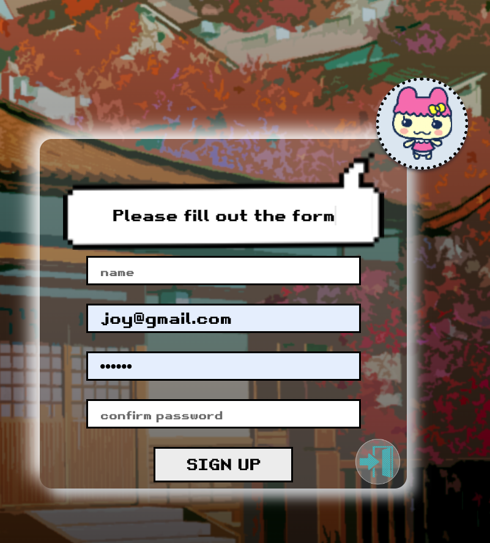

<h1>Kichi's World - The next generation</h1>


<div style="color:#000;font-size: 1.5rem; margin:1rem; border-radius:1rem; border:black dotted 5px; padding:2rem; background: linear-gradient(to top, #cfd9df 0%, #e2ebf0 100%);">
Kichi's World is a gamify single daily task app. By completing your daily TASUKU, a task in japanese, you earn points. By not completing the TASUKU you harm Kichi's health. Kichi will do all that she can in order to keep you high motivated to complete your daily TASUKU. Wanna know how? Download the App, and discover Kichi's world by yourself 😇
</div>
<br>

<!-- This is my solution to the [Product preview card component challenge on Frontend Mentor](https://www.frontendmentor.io/challenges/product-preview-card-component-GO7UmttRfa). -->

  <h2>Table of Contents</h2>

- [How to install?](#how-to-install)
- [How to play?](#how-to-play)
- [Inspiration](#inspiration)
- [Highlight of code snippets \& Screenshots](#highlight-of-code-snippets--screenshots)
- [Built with](#built-with)
- [What I learned](#what-i-learned)
- [Continued development](#continued-development)
- [Useful resources](#useful-resources)
- [Author](#author)

### How to install?

```
npm install
```

<hr>


### How to play?

<details>
<ul>
<li>Enter to the following website and click on the registration button</li>
<li>After registration, you are ready to login into Kichi's world.</li>
<li>On the main screen, the Dashboard, Kichi will greeting you and will ask you to click on her to get some more instructions.</li>
<li>The Tasuku button will lead you to the screen, where you can choose your daily tasuku.</li>
<li>After Setting a Tasuku, Kich will wait for your feedback of completing or not completing the Tasuku</li>
<li>To inform Kichi about your achievement, use the thumbs buttons </li>
<li>By completing the task successfully, Kichi will give you starts, that represent your health points in the game.</li>
<li>By not completing the task, you will los your starts, and Kich will start to feel not well.</li>
<li>Still Kichi will motivate you, to try next day in with motivational quotes</li>
<li>By completing the Tasukus, Kichi will start to recover, by not completing the Tasukus, Kichi will become sick and will die</li>
</ul>
</details>

<hr>

### Inspiration

  <details>

**THE IDEA:** Kichi's World has been created as a group project in the full-stack development program at the Code wild school with [Bryan Blair](http://https://github.com/BryanClawdBlair).

<ins>This project is inspired by two iconic applications:</ins>:

- [Tamagucci](https://en.wikipedia.org/wiki/Tamagotchi) use to be in the 90's a poplar virtual pet, where the user supposed to feed it, play with it, and of course clean the poo:) A decent solution for kids, that their parents didn't allow them pets at home
- [Habitica](https://habitica.com/) an open source gamilfy application, with a RPG astatic, where the user earn coins & experience points by completing tasks and decrease heath by not completing the tasks.

**THE UX/UI INSPIRATION:** The app is inspired by the colorful japanese esthetic, with self-made icons using _Photoshop_ & _Figma_. The goal it to make the UX goals were to taking care to all the small details on the screen to maximize the engagement of the user.

</details><hr>

### Highlight of code snippets & Screenshots

<summery>verification logic by registration</summery>

  <details>



```
const validate = () => {
    console.log(userName, email, password, conPassword);

    // #### conditions for the form validation
    // 1. user name
    if (userName.length > 1) {
      setEUserName('');
      setUColor('green');
    } else {
      setEUserName('Username must contain at least 8 characters');
      setUColor('red');
    }

    // 2. email
    if (email.includes('@') && email.includes('.com')) {
      setEEmail('');
      setEColor('green');
    } else {
      setEEmail('Must be a valid email address');
      setEColor('red');
    }

    // 3. password
    if (password.length > 4) {
      setEPassword('');
      setPColor('green');
    } else {
      setEPassword('Please enter a password with at least 8 digits');
      setPColor('red');
    }

    // 4. confirm password
    if (password !== '' && password === conPassword) {
      setEConPassword('');
      setConPcolor('green');
    } else {
      setEConPassword('Passwords not matched');
      setConPcolor('red');
    }
  };
```

</details> <br>

<summery>Responsiveness of the website</summery>

<details>


<p>Using two media queries sizes for medium and small screen. the goal is to make it responsive in the main code, and make small changes to maximize the ux</p>

```
/* ===================== MEDIA QUERIES (MEDIUM DEVICES) =========================*/
@media screen and (max-width: 1024px) {
  .kichi-logo {
    right: -4%;
    top: -5%;
  }
}

/* ===================== MEDIA QUERIES (SMALL DEVICES) ========================= */
@media screen and (max-width: 600px) {
  .top-stage {
    gap: 2rem;
  }}

```

</details><br>

<summery>Using localStorage</summery>

<details>


<p>Using localStorage to save the information of the user for the login</p>

```
  const handleLogin = () => {

    // ### localStorage ####
    // getting the item from the localStorage and convert it to JS syntax
    // this item has been created in the registration page
    const users = JSON.parse(localStorage.getItem('users'));

    // Using the For of loop, optional since the ES6
    // Looping through all the users to find a match with the user & the password
    //it's true, then iterate by one and show me the message
    let i = 0;
    for (let el of users) {
      if (el.email === email && el.password === password) {
        i++;
      }
    }

    //### START CONDITION to login to the Dashboard ####
    //if the variable i ==== 1, it means that there is a match with the login and the password

    if (i === 1) {

      // ### LocalStorage ###
      // 1.  set 2 new items in the localStorage
      alert('Login Successful');
      localStorage.setItem('loggedIn', 'yes');
      localStorage.setItem('currentUser', email);

      // 2. Set the time after the login
      const today = new Date();
      const currentTime =
        today.getFullYear() +
        '-' +
        (today.getMonth() + 1) +
        '-' +
        (today.getDay() + 1);

      // ### LocalStorage ###
      // 3. Get the user item,  currentUser and convert it to js
      let localEntry = JSON.parse(localStorage.getItem('users'));
      let currentUserEntry = localStorage.getItem('currentUser');

      // 4. Using fine index to find the position of the users email in the array
      // in order to add read and add information
      //getting the index number
      let index = localEntry.findIndex(
        (element) => element.email === currentUserEntry
      );

      // 5. Add another property to the existing object in the index position
      // currentTime is the timeStamp of the login
      localEntry[index] = {
        ...localEntry[index],
        time: currentTime,
        //hp: currentUserHP,
      };

      // ### localStorage ###
      // 6. Replace the item users with the new information (the currentTime property)
      localStorage.setItem('users', JSON.stringify(localEntry));

```

</details>

<hr>

### Built with

- Semantic HTML5 markup
- CSS custom properties
- CSS Flexbox
- CSS Grid
- React.js
- JavaScript
- localStorage

<hr>

### What I learned

- How to make a website responsive with small changes using grid, flex & media query
- How to use the localStorage to win a stored data, that can be used also after refreshing the page
- How to structure the React application with reusable components by using dynamic, conditional props

<hr>

### Continued development

- Create a homepage with an introduction of the website
- Improve the game option by adding a screen to check the stats: points & completing tasks
- Continue manufacturing the code, make it dry but readable as possible

<hr>

### Useful resources

- [Responsiveness ](https://www.youtube.com/watch?v=0ohtVzCSHqs&t=2s) - This helped me for the responsiveness in the website. I really recommend in general about Kevin Powell's content.
- [LocalStorage](https://youtu.be/6eFwtaZf6zc) - This tutorial helped me to increase my knowledge and understanding the features of the localStorage, using the common methods:setItem,
  getItem, removeItem, clear.

<hr>

### Author

- LinkedIn - [@thaler_mo](https://www.linkedin.com/in/moran-thaler/)
